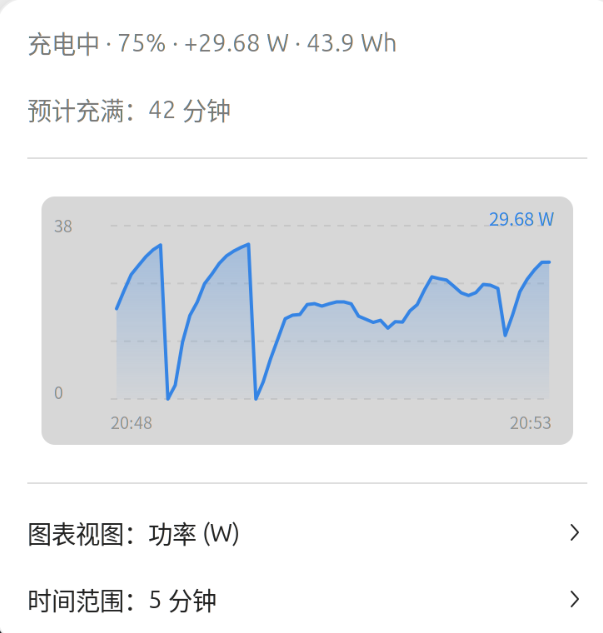

# Power & Energy Monitor

## 项目简介

Power & Energy Monitor 是一款 GNOME Shell 扩展，用于在顶栏实时显示电池功耗、剩余能量与预计剩余时间。它使用 Cairo 绘制近期变化曲线，支持功率、剩余能量、剩余时间三种图表视图，并提供多级数据保留策略与可选的持久化存储。

本扩展由 Moeblack 开发，使用 LimCode 辅助完成。

## 功能特性

1. 顶栏显示电池功耗、剩余能量与预计剩余时间。
2. 弹出菜单内绘制近期变化曲线，支持三种图表视图：
   - **power**：功率曲线
   - **energy**：剩余能量曲线
   - **remaining**：剩余时间曲线
3. 多级数据保留策略：
   - 原始采样数据，默认保留 1 小时，范围 0–720 小时，0 表示永久保留
   - 1 分钟聚合数据，默认保留 30 天，范围 0–3650 天，0 表示永久保留
   - 1 小时聚合数据，默认保留 365 天，范围 0–3650 天，0 表示永久保留
4. 可选时间范围：5 分钟、15 分钟、1 小时、5 小时、12 小时、1 天、3 天、1 周、自定义
   - 自定义范围支持分钟、小时、天三种单位，数值范围 1–365
5. 图表曲线颜色可自定义，默认 `#3584e4`。
6. 采样间隔可配置，默认 5 秒，范围 1–60 秒。
7. 数据可持久化到磁盘（默认开启），关闭后仅保留在内存中。
8. 图表使用 Cairo 绘制，颜色跟随 GNOME 主题。
9. 兼容 GNOME Shell 45–50。

## 截图

**顶栏显示**：实时展示当前功率与剩余能量。



**弹出菜单与功率曲线**：展开菜单后显示充电状态、预计充满时间以及功率变化曲线。


## 安装方式

本扩展提供三条安装途径，推荐按照以下顺序选择：

1. **从 extensions.gnome.org 安装**（最方便，一键完成）。
2. **从 GitHub Release 下载 zip 安装**（适合扩展尚未上架或需要离线安装）。
3. **从源码安装**（适合开发或需要最新代码）。

### 从 extensions.gnome.org 安装

- 前提：扩展已上传至 [extensions.gnome.org](https://extensions.gnome.org) 并通过审核。
- 用户访问扩展页面，点击开关即可一键安装，无需命令行。

开发者上传方式：

```bash
gnome-extensions pack
```

然后访问 [https://extensions.gnome.org/upload/](https://extensions.gnome.org/upload/) 上传打包后的 zip 文件，等待审核。审核要求遵守 [GNOME 扩展审核指南](https://gjs.guide/extensions/review-guidelines/review-guidelines.html)，zip 体积不超过 5 MB。

### 从 GitHub Release 下载 zip 安装

1. 在项目的 [GitHub Release](https://github.com/moeblack/gnomeBattaryWatch/releases) 页面下载扩展 zip 包。
2. 执行以下命令安装：

```bash
gnome-extensions install <zip文件路径> --force
```

3. 重启 GNOME Shell：
   - Wayland：注销后重新登录。
   - X11：按 `Alt+F2`，输入 `r`，然后回车。
4. 启用扩展：

```bash
gnome-extensions enable power-energy-monitor@moeblack.github.io
```

也可以在扩展管理器中手动启用。

### 从源码安装

```bash
git clone https://github.com/moeblack/gnomeBattaryWatch.git
cp -r gnomeBattaryWatch ~/.local/share/gnome-shell/extensions/power-energy-monitor@moeblack.github.io
glib-compile-schemas ~/.local/share/gnome-shell/extensions/power-energy-monitor@moeblack.github.io/schemas
```

重启 GNOME Shell 后启用扩展：

- Wayland：注销后重新登录。
- X11：按 `Alt+F2`，输入 `r`，然后回车。

启用命令：

```bash
gnome-extensions enable power-energy-monitor@moeblack.github.io
```

## 配置说明

配置项 schema id：`org.gnome.shell.extensions.power-energy-monitor`

| 配置键 | 类型 | 默认值 | 范围/可选值 | 说明 |
|---|---|---|---|---|
| sample-interval-seconds | 整数 | 5 | 1–60 秒 | 采样间隔 |
| raw-retention-hours | 整数 | 1 | 0–720 小时 | 原始数据保留时长，0 为永久 |
| mid-retention-days | 整数 | 30 | 0–3650 天 | 1 分钟聚合数据保留时长，0 为永久 |
| coarse-retention-days | 整数 | 365 | 0–3650 天 | 1 小时聚合数据保留时长，0 为永久 |
| default-time-range | 字符串 | 1h | 5m/15m/1h/5h/12h/1d/3d/1w/custom | 默认时间范围 |
| default-view | 字符串 | power | power/energy/remaining | 默认图表视图 |
| chart-color | 字符串 | #3584e4 | 十六进制 RGB | 图表曲线颜色 |
| persist-to-disk | 布尔 | true | true/false | 是否持久化历史数据 |
| custom-range-value | 整数 | 30 | 1–365 | 自定义时间范围数值 |
| custom-range-unit | 字符串 | m | m/h/d | 自定义时间范围单位 |

## 兼容性

- GNOME Shell 45、46、47、48、49、50

## 作者与开发工具

- **作者**：Moeblack
- **开发工具**：LimCode
- **GitHub 仓库**：[https://github.com/moeblack/gnomeBattaryWatch](https://github.com/moeblack/gnomeBattaryWatch)
